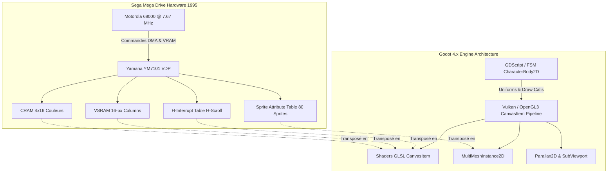
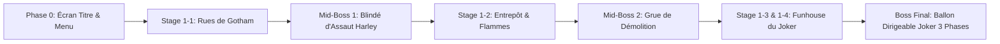
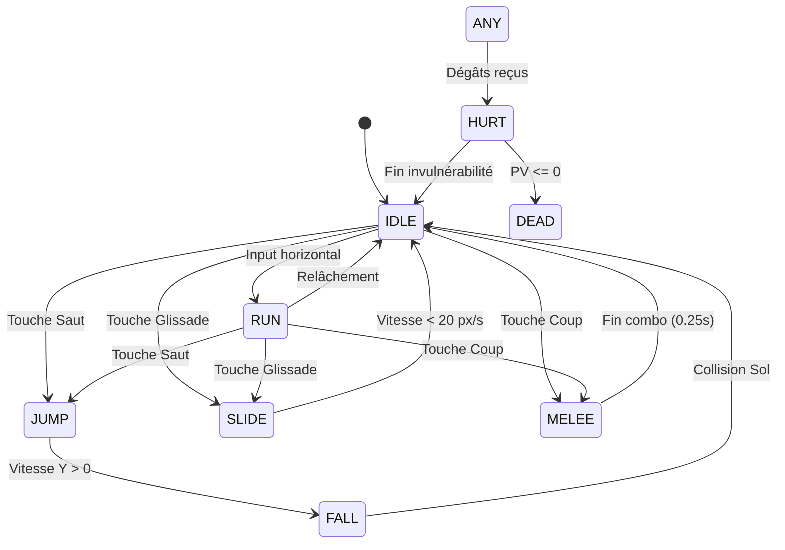

# The Adventures of Batman & Robin (Mega Drive 1995) ➔ Prototype Godot 4.x Masterclass

> **Recréation technique intégrale du Niveau 1 (*« Happy Birthday to Me! »*) depuis l'écran d'accueil jusqu'au boss de fin de niveau (The Joker), basée sur l'ingénierie inverse matérielle du VDP Sega Mega Drive et les secrets de développement de Jon Burton (Traveller's Tales / Clockwork Tortoise).**

---

## 📋 Table des Matières

1. [Vision & Spécifications du Projet](#1-vision--spécifications-du-projet)
2. [Matrice d'Équivalence : VDP Mega Drive vs Godot 4.x](#2-matrice-déquivalence--vdp-mega-drive-vs-godot-4x)
3. [Les 7 Secrets de Programmation de Jon Burton](#3-les-7-secrets-de-programmation-de-jon-burton)
   - [Secret 1 : Sol 3D & Façades en Perspective (Raster Skewing)](#secret-1--sol-3d--façades-en-perspective-raster-skewing)
   - [Secret 2 : Flammes Ondulantes Organiques (Dynamic Billowing Fire)](#secret-2--flammes-ondulantes-organiques-dynamic-billowing-fire)
   - [Secret 3 : Boss de Sphères 3D & Palette Dimming (Lissajous Z-Fog)](#secret-3--boss-de-sphères-3d--palette-dimming-lissajous-z-fog)
   - [Secret 4 : Tangage & Rotation par Tranches de 16px (Pseudo-Mode 7)](#secret-4--tangage--rotation-par-tranches-de-16px-pseudo-mode-7)
   - [Secret 5 : Route 3D Hyperbolique & Cycle de Palette (Raster Road)](#secret-5--route-3d-hyperbolique--cycle-de-palette-raster-road)
   - [Secret 6 : Projecteur Vectoriel & Tramage Bayer 4x4 (Byte Plotting)](#secret-6--projecteur-vectoriel--tramage-bayer-4x4-byte-plotting)
   - [Secret 7 : Tunnel Cylindrique 3D en Coordonnées Polaires](#secret-7--tunnel-cylindrique-3d-en-coordonnées-polaires)
4. [Anatomie Complète du Niveau 1 : « Happy Birthday to Me! »](#4-anatomie-complète-du-niveau-1--happy-birthday-to-me)
5. [Contrôleur Joueur & Machine à États Finis (FSM)](#5-contrôleur-joueur--machine-à-états-finis-fsm)
6. [Arsenal d'Armes & Système de Surcharge](#6-arsenal-darmes--système-de-surcharge)
7. [Feuille de Route Opérationnelle (6 Sprints)](#7-feuille-de-route-opérationnelle-6-sprints)
8. [Arborescence du Projet Godot 4.x](#8-arborescence-du-projet-godot-4x)
9. [Documentation Interactive & Serveur Local](#9-documentation-interactive--serveur-local)

---

## 1. Vision & Spécifications du Projet

### Contexte Historique
Sorti en 1995 sur Sega Mega Drive / Genesis et développé par le studio légendaire **Clockwork Tortoise**, *The Adventures of Batman & Robin* est universellement reconnu comme l'un des sommets techniques absolus de l'ère 16-bit. Le jeu pousse la puce graphique **Yamaha YM7101 (VDP)** et le processeur **Motorola 68000 (7.67 MHz)** dans leurs derniers retranchements pour afficher des effets pseudo-3D, des déformations de textures et des transparences que la console n'était théoriquement pas conçue pour produire sans puce d'assistance matérielle.

### Objectif du Projet
Développer sous **Godot 4.x** un prototype jouable à l'identique du **Niveau 1 complet** :
- **Écran Titre & Sélection :** Interface authentique, sélection de Batman / Robin, musique FM chiptune de Jesper Kyd.
- **Stage 1-1 (Gotham Streets) :** Défilement parallaxe, sol cisaillé 3D, projecteurs dans le ciel, ennemis communs et Mid-Boss 1 (Blindé d'assaut d'Harley Quinn).
- **Stage 1-2 (Chemical Plant / Warehouse) :** Pièges de vapeurs, flammes ondulantes en H-Scroll et Mid-Boss 2 (Grue de démolition d'Harley Quinn).
- **Stage 1-3 & 1-4 (Funhouse & Dirigeable du Joker) :** Combat de boss en 3 phases contre le ballon géant du Joker avec rotation pseudo-Mode 7.

### Décisions Directrices Confirmées
1. **Assets :** Utilisation initiale de *placeholders* géométriques contrastés (hitboxes, silhouettes vectorielles, particules) pour valider à 100 % la physique, le feeling arcade et les shaders avant le remplacement par les sprites finaux.
2. **Mode de Jeu :** Mode Solo prioritaire (choix de Batman ou Robin) pour garantir une caméra réactive et des performances stables à 60 FPS constants.
3. **Équilibrage :** Respect strict de la difficulté arcade punitive de 1995 (vagues denses, tirs croisés, absence de régénération automatique).

---

## 2. Matrice d'Équivalence : VDP Mega Drive vs Godot 4.x

Le processeur graphique de la Mega Drive (**Yamaha YM7101**) ne possède ni rasteriseur 3D, ni canal alpha, ni matrice de transformation affine (contrairement au Mode 7 de la SNES). Tout repose sur la manipulation à la volée des tables mémoire pendant le balayage du canon à électrons (HBLANK et VBLANK).



### Tableau Comparatif Exhaustif

| Effet Visuel / Mécanique | Matériel Mega Drive (1995) | Astuce Clockwork Tortoise | Transposition Godot 4.x |
| :--- | :--- | :--- | :--- |
| **Sol 3D & Façades en Perspective** | Table H-Scroll VRAM + H-Interrupt | Décalage horizontal par ligne proportionnel à $(1 - y/H)$ | Shader `canvas_item` modifiant `UV.x` selon la coordonnée verticale. |
| **Flammes Ondulantes Vivantes** | Animation 6 frames en VRAM + H-Scroll | Onde sinusoïdale d'amplitude croissante injectée à l'interruption horizontale | `AnimatedSprite2D` + Shader `sin(uv.y * freq + TIME * spd)`. |
| **Boss Serpent de Sphères 3D** | Table de sprites VDP (max 80) + CRAM | Calcul trajectoire Lissajous CPU, pas de rotation de texture, Z-Fog par permutation de palette | `MultiMeshInstance2D` avec mise à jour des matrices de transformation et modulation de couleur en 1 seul Draw Call. |
| **Rotation Dirigeable (Pseudo-Mode 7)** | VSRAM (défilement vertical par blocs de 16px) + H-Scroll | Découpage du sprite en tranches verticales de 16px avec décalage continu | Shader quantifiant les colonnes : `floor(UV.x * 20.0) / 20.0` combiné au cisaillement. |
| **Autoroute 3D & Damier OutRun** | Plan B + Palette Cycling ligne par ligne | Projection hyperbolique $1/y$, virages paraboliques, alternance d'index de palette | `ColorRect` plein écran avec shader de calcul de coordonnées hyperboliques et cycle de couleur. |
| **Projecteur Semi-Transparent** | VRAM Tile Buffer + Écriture CPU par octet | Tracé rapide de 2 pixels par octet (Byte Plotting) + Matrice Bayer 4x4 | Shader `canvas_item` échantillonnant une matrice de dither 4x4 sans mélange alpha flou. |
| **Tunnel Polaire Cylindrique** | Table trigonométrique précalculée en ROM | Projection mathématique cartésien ➔ polaire $(\theta, 1/r)$ | Shader de coordonnées polaires `atan2(y, x)` et `fov / length(p)`. |

---

## 3. Les 7 Secrets de Programmation de Jon Burton

Tirés des analyses techniques des deux vidéos de Jon Burton (fondateur de Traveller's Tales) :
- **Vidéo 1 :** [Traveller's Tales / Coding Secrets Part 1](https://www.youtube.com/watch?v=Z0S92Fs5gOg)
- **Vidéo 2 :** [Traveller's Tales / Coding Secrets Part 2](https://www.youtube.com/watch?v=M7b0uUEl5hc)

---

### Secret 1 : Sol 3D & Façades en Perspective (Raster Skewing)

* **Référence Vidéo :** [Jon Burton Vidéo 1 à 00:38](https://youtu.be/Z0S92Fs5gOg?t=38)
* **Scène du Jeu :** *Stage 1-1 (Gotham Streets)* — Batman court sur le pavé des rues pendant que les immeubles défilent avec une impression de profondeur saisissante.
* **Problème Matériel :** Le VDP Mega Drive ne gère aucun polygone ni mapping de texture 3D.
* **Solution Clockwork Tortoise :** Pendant le balayage CRT, la table H-Scroll contient une valeur de décalage différente pour chaque ligne de balayage ($y$). Le décalage horizontal suit la formule :
  $$\Delta X(y) = (1.0 - \frac{y}{H}) \times \text{SkewFactor}$$
  En synchronisant la largeur des dalles avec le modulo du décalage, le pavé se répète parfaitement à l'infini.

#### Implémentation Godot 4.x (`raster_skew.gdshader`)
```glsl
shader_type canvas_item;

uniform float skew_amount : hint_range(-2.0, 2.0) = 0.65;
uniform float scroll_speed = 1.2;
uniform float depth_fade : hint_range(0.0, 1.0) = 0.4;
uniform sampler2D street_texture : repeat_enable, filter_nearest;

void fragment() {
    float depth = clamp(UV.y, 0.001, 1.0);
    vec2 skewed_uv = UV;
    
    // Décalage horizontal inversement proportionnel à la profondeur
    skewed_uv.x += (1.0 - depth) * skew_amount + (TIME * scroll_speed);
    
    vec4 tex_color = texture(street_texture, fract(skewed_uv));
    
    // Atténuation atmosphérique avec la distance (Z-Fade)
    vec3 shaded_rgb = mix(tex_color.rgb * depth_fade, tex_color.rgb, depth);
    COLOR = vec4(shaded_rgb, tex_color.a);
}
```

---

### Secret 2 : Flammes Ondulantes Organiques (Dynamic Billowing Fire)

* **Référence Vidéo :** [Jon Burton Vidéo 1 à 02:16](https://youtu.be/Z0S92Fs5gOg?t=136)
* **Scène du Jeu :** *Stage 1-2 (Chemical Plant)* — D'immenses colonnes de flammes ondulent au premier plan dans l'usine désaffectée.
* **Problème Matériel :** Animer un brasier géant image par image saturerait les 64 Ko de VRAM de la console.
* **Solution Clockwork Tortoise :** Seules 6 frames d'animation fixes de flammes sont stockées en VRAM. Le VDP injecte à chaque ligne de balayage une perturbation horizontale sinusoïdale d'amplitude modulée par la hauteur :
  $$\Delta X(y, t) = \sin(\omega t + k \cdot y) \times (1.0 - y)^2 \times A$$
  La base du feu reste parfaitement ancrée au sol ($y = 1$), tandis que la cime ondule furieusement.

#### Implémentation Godot 4.x (`billowing_fire.gdshader`)
```glsl
shader_type canvas_item;

uniform float wave_frequency = 12.0;
uniform float wave_speed = 4.5;
uniform float max_amplitude = 0.08;

void fragment() {
    // La déformation est nulle en bas (sol) et maximale en haut (pointes des flammes)
    float height_factor = pow(1.0 - UV.y, 1.8);
    float offset_x = sin(UV.y * wave_frequency + TIME * wave_speed) * max_amplitude * height_factor;
    
    vec2 distorted_uv = vec2(UV.x + offset_x, UV.y);
    vec4 col = texture(TEXTURE, distorted_uv);
    
    // Accentuation de la luminescence orangée au sommet
    col.rgb += vec3(0.2, 0.08, 0.0) * height_factor;
    COLOR = col;
}
```

---

### Secret 3 : Boss de Sphères 3D & Palette Dimming (Lissajous Z-Fog)

* **Référence Vidéo :** [Jon Burton Vidéo 1 à 02:53](https://youtu.be/Z0S92Fs5gOg?t=173)
* **Scène du Jeu :** *Boss du Serpent Métallique* — Un gigantesque serpent articulé composé de sphères dorées ondule dans l'espace 3D vers le joueur.
* **Problème Matériel :** Pas de rendu 3D temps réel sur Mega Drive ; le CPU ne peut pas calculer de polygones ombrés.
* **Solution Clockwork Tortoise :**
  1. **Invariance par rotation :** Une sphère vue sous n'importe quel angle reste un cercle avec son point spéculaire au même endroit. Aucune rotation 3D de texture n'est nécessaire !
  2. **Trajectoire Lissajous 3D :** Les coordonnées $(x, y, z)$ de chaque sphère sont calculées par de simples équations trigonométriques déphasées :
     $$X_i = A_x \sin(\omega_x t + \phi_i), \quad Y_i = A_y \cos(\omega_y t + \phi_i), \quad Z_i = A_z \sin(\omega_z t + \phi_i)$$
  3. **Z-Fog par Palette Swap :** La profondeur $Z$ détermine l'échelle du sprite et son index de palette CRAM (les boules lointaines utilisent une palette sombre et désaturée).

#### Implémentation Godot 4.x (`MultiSphereBoss.gd`)
```gdscript
extends Node2D
class_name MultiSphereBoss

@export var sphere_count: int = 24
@export var base_texture: Texture2D
@onready var multimesh_instance: MultiMeshInstance2D = $MultiMeshInstance2D

var time: float = 0.0

func _ready() -> void:
    var mm := MultiMesh.new()
    mm.transform_format = MultiMesh.TRANSFORM_2D
    mm.use_colors = true
    mm.instance_count = sphere_count
    
    var quad := QuadMesh.new()
    quad.size = Vector2(32, 32)
    mm.mesh = quad
    multimesh_instance.multimesh = mm

func _process(delta: float) -> void:
    time += delta * 1.5
    var mm := multimesh_instance.multimesh
    
    # Structure pour trier les sphères selon Z (Back-to-Front Painter's Algorithm)
    var spheres := []
    for i in range(sphere_count):
        var t := time - (float(i) * 0.18)
        var x := sin(t * 1.2) * 120.0
        var y := cos(t * 0.8) * 60.0 + sin(t * 2.4) * 20.0
        var z := sin(t * 1.0) * 80.0 # Profondeur [-80, +80]
        spheres.append({"index": i, "x": x, "y": y, "z": z})
    
    spheres.sort_custom(func(a, b): return a.z < b.z)
    
    for i in range(sphere_count):
        var s = spheres[i]
        # Échelle proportionnelle à Z
        var scale_factor := remap(s.z, -80.0, 80.0, 0.45, 1.25)
        var trans := Transform2D(0.0, Vector2(scale_factor, scale_factor), 0.0, Vector2(s.x, s.y))
        mm.set_instance_transform_2d(i, trans)
        
        # Z-Fog : assombrissement des sphères arrière
        var darkness := remap(s.z, -80.0, 80.0, 0.25, 1.0)
        var col := Color(darkness, darkness * 0.85, darkness * 0.3, 1.0)
        mm.set_instance_color(i, col)
```

---

### Secret 4 : Tangage & Rotation par Tranches de 16px (Pseudo-Mode 7)

* **Référence Vidéo :** [Jon Burton Vidéo 1 à 04:46](https://youtu.be/Z0S92Fs5gOg?t=286)
* **Scène du Jeu :** *Boss du Ballon Dirigeable du Joker* — Le zeppelin géant pivote, s'incline et flotte au-dessus de Gotham City.
* **Problème Matériel :** Contrairement à la SNES, le VDP Mega Drive ne possède pas de Mode 7. De plus, son défilement vertical (**V-Scroll**) ne fonctionne pas par ligne, mais uniquement par **colonnes de 16 pixels** (2 tuiles de 8x8).
* **Solution Clockwork Tortoise :** Découper le sprite du dirigeable en tranches verticales indépendantes de 16 pixels. En combinant un décalage vertical par tranche avec un décalage horizontal par ligne (Line Scroll), le dirigeable pivote de manière fluide avec un angle $\theta$ :
  $$\Delta Y(\text{colonne}) = (\text{colonne} - \text{centre}) \times \tan(\theta)$$
  $$\Delta X(\text{ligne}) = (\text{ligne} - \text{centre}) \times \sin(\theta)$$

#### Implémentation Godot 4.x (`pseudo_mode7_blimp.gdshader`)
```glsl
shader_type canvas_item;

uniform float tilt_angle : hint_range(-0.5, 0.5) = 0.2;
uniform float column_count = 20.0; // 320px / 16px = 20 colonnes matérielles

void fragment() {
    // Simulation matérielle : quantification par tranches de 16 pixels
    float col_index = floor(UV.x * column_count) / column_count;
    float vertical_offset = (col_index - 0.5) * tilt_angle;
    
    vec2 mode7_uv;
    mode7_uv.x = UV.x;
    mode7_uv.y = UV.y + vertical_offset;
    
    // Découpage propre hors limites
    if (mode7_uv.y < 0.0 || mode7_uv.y > 1.0) {
        COLOR = vec4(0.0);
    } else {
        COLOR = texture(TEXTURE, mode7_uv);
    }
}
```

---

### Secret 5 : Route 3D Hyperbolique & Cycle de Palette (Raster Road)

* **Référence Vidéo :** [Jon Burton Vidéo 2 à 02:39](https://youtu.be/M7b0uUEl5hc?t=159)
* **Scène du Jeu :** *Stage 3 (Course Poursuite Batmobile)* — La Batmobile fonce à pleine vitesse sur une route courbée avec bordures en damier rouge et blanc.
* **Problème Matériel :** Aucun moteur 3D polygonal n'était envisageable pour générer une chaussée texturée fluide à 60 FPS.
* **Solution Clockwork Tortoise (Méthode OutRun) :**
  1. **Projection en $1/y$ :** Pour chaque ligne de balayage sous la ligne d'horizon, la distance perçue est :
     $$Z(y) = \frac{K}{y - Y_{\text{horizon}}}$$
  2. **Courbures paraboliques :** Le décalage horizontal de chaque ligne suit une fonction quadratique :
     $$\Delta X(y) = \text{Courbure} \times (\frac{y - Y_{\text{horizon}}}{H - Y_{\text{horizon}}})^2$$
  3. **Palette Cycling :** L'illusion de vitesse infinie est créée sans bouger le décor, simplement en décalant cycliquement les couleurs des bandes et de l'asphalte dans la CRAM à chaque trame !

#### Implémentation Godot 4.x (`raster_road.gdshader`)
```glsl
shader_type canvas_item;

uniform float horizon_y = 0.38;
uniform float road_curve = 0.45;
uniform float road_speed = 3.5;

void fragment() {
    if (UV.y < horizon_y) {
        // Ciel nocturne de Gotham
        COLOR = vec4(0.04, 0.05, 0.1, 1.0);
    } else {
        float rel_y = (UV.y - horizon_y) / (1.0 - horizon_y);
        float z = 1.0 / max(rel_y, 0.001); // Distance projective
        
        // Décalage du centre de la route (virage)
        float curve_offset = road_curve * pow(rel_y, 2.0);
        float road_center = 0.5 + curve_offset;
        float road_width = 0.12 + 0.75 * rel_y;
        
        float dist_from_center = abs(UV.x - road_center);
        
        if (dist_from_center > road_width) {
            // Bas-côté / Terre
            COLOR = vec4(0.08, 0.08, 0.08, 1.0);
        } else {
            // Calcul du damier par cycle temporel
            float stripe = sin(z * 4.0 - TIME * road_speed * 10.0);
            
            if (dist_from_center > road_width * 0.85) {
                // Vibreurs rouge et blanc
                COLOR = (stripe > 0.0) ? vec4(0.9, 0.1, 0.1, 1.0) : vec4(0.95, 0.95, 0.95, 1.0);
            } else {
                // Asphalte alterné sombre/clair
                COLOR = (stripe > 0.0) ? vec4(0.18, 0.2, 0.24, 1.0) : vec4(0.14, 0.15, 0.18, 1.0);
            }
        }
    }
}
```

---

### Secret 6 : Projecteur Vectoriel & Tramage Bayer 4x4 (Byte Plotting)

* **Référence Vidéo :** [Jon Burton Vidéo 2 à 04:27](https://youtu.be/M7b0uUEl5hc?t=267)
* **Scène du Jeu :** *Écran d'Accueil & Toits de Gotham* — De puissants faisceaux lumineux de projecteurs balaient la ville avec une transparence vaporeuse saisissante.
* **Problème Matériel :** La Mega Drive ne possède aucun canal alpha matériel 32-bit (ARGB). Dessiner pixel par pixel saturait le bus CPU.
* **Solution Clockwork Tortoise :**
  1. **Byte Plotting (2 pixels par écriture) :** Les pixels Mega Drive étant codés sur 4 bits (16 couleurs par palette), chaque écriture d'octet (`MOVE.B`) écrit simultanément 2 pixels voisins, divisant par deux les cycles CPU.
  2. **Matrice de tramage ordonné Bayer 4x4 :** L'intensité lumineuse est traduite en une grille de points en quinconce. Sur un écran cathodique (CRT) à masque d'ombre, le flou optique fusionne naturellement les points en une semi-transparence immaculée sans la moindre perte de performance.

#### Implémentation Godot 4.x (`bayer_searchlight.gdshader`)
```glsl
shader_type canvas_item;

uniform float beam_angle = 0.4;
uniform vec2 light_origin = vec2(0.5, 1.0);
uniform float beam_width = 0.25;

// Matrice ordonnée Bayer 4x4 normalisée [0, 15] / 16.0
const mat4 BAYER_MATRIX = mat4(
    vec4( 0.0,  8.0,  2.0, 10.0) / 16.0,
    vec4(12.0,  4.0, 14.0,  6.0) / 16.0,
    vec4( 3.0, 11.0,  1.0,  9.0) / 16.0,
    vec4(15.0,  7.0, 13.0,  5.0) / 16.0
);

void fragment() {
    vec2 p = UV - light_origin;
    float dist = length(p);
    float angle = atan(p.x, -p.y);
    
    // Intensité gaussienne du faisceau lumineux
    float intensity = exp(-pow((angle - beam_angle) / beam_width, 2.0)) * (1.0 - dist * 0.7);
    intensity = clamp(intensity, 0.0, 1.0);
    
    // Coordonnées de pixel entières pour la grille Bayer
    ivec2 pixel_coord = ivec2(FRAGCOORD.xy);
    float threshold = BAYER_MATRIX[pixel_coord.x % 4][pixel_coord.y % 4];
    
    vec4 base_color = texture(TEXTURE, UV);
    
    // Si l'intensité dépasse le seuil Bayer, on allume le pixel en jaune/cyan clair
    if (intensity > threshold) {
        vec3 lit = mix(base_color.rgb, vec3(0.95, 0.95, 0.7), 0.6);
        COLOR = vec4(lit, base_color.a);
    } else {
        COLOR = base_color;
    }
}
```

---

### Secret 7 : Tunnel Cylindrique 3D en Coordonnées Polaires

* **Référence Vidéo :** [Jon Burton Vidéo 2 à 04:57](https://youtu.be/M7b0uUEl5hc?t=297)
* **Scène du Jeu :** *Niveau Métro / Tube Sous-terrain* — Batman court à l'intérieur d'un conduit tubulaire infini à damier vert néon qui tourne et s'enfonce dans l'écran.
* **Problème Matériel :** Rendre un maillage cylindrique 3D en texture-mapping temps réel était hors de portée du hardware.
* **Solution Clockwork Tortoise :** Une simple formule de remapping mathématique 2D vers polaire :
  - **Angle polaire :** $\theta = \text{atan2}(y - y_c, x - x_c)$
  - **Rayon inverse (distance) :** $U_z = \frac{K}{\sqrt{(x - x_c)^2 + (y - y_c)^2}}$
  En appliquant un défilement continu sur $\theta$ (rotation) et sur $U_z$ (avancée), une simple texture 2D s'enroule parfaitement autour d'un cylindre infini.

#### Implémentation Godot 4.x (`polar_tunnel.gdshader`)
```glsl
shader_type canvas_item;

uniform float tunnel_speed = 1.4;
uniform float rotation_speed = 0.5;
uniform float fov_depth = 0.35;
uniform sampler2D wall_texture : repeat_enable, filter_nearest;

void fragment() {
    vec2 p = (UV - vec2(0.5)) * 2.0;
    float r = length(p);
    
    if (r < 0.02) {
        // Trou noir central masquant la singularité mathématique
        COLOR = vec4(0.0, 0.0, 0.0, 1.0);
    } else {
        float angle = atan(p.y, p.x);
        vec2 polar_uv;
        polar_uv.x = (angle / 3.14159265) * 0.5 + 0.5 + TIME * rotation_speed;
        polar_uv.y = (fov_depth / r) + TIME * tunnel_speed;
        
        vec4 col = texture(wall_texture, fract(polar_uv));
        // Effet de halo radial s'assombrissant vers le fond
        COLOR = vec4(col.rgb * clamp(r * 1.5, 0.0, 1.0), 1.0);
    }
}
```

---

## 4. Anatomie Complète du Niveau 1 : « Happy Birthday to Me! »



### Phase 0 : Écran d'Accueil & Menu Principal (`TitleScreen.tscn`)
- **Logo Animé :** Chauve-souris stylisée avec reflets dorés et palette-cycling.
- **Thème Musical :** Chiptune FM de Jesper Kyd (rythme techno percutant à 138 BPM).
- **Options :** Solo / Co-op, Difficulté (Normal / Hard / Mania), Attribution des touches, Sound Test.
- **Sélection :** Fiches distinctes de Batman (vitesse et allonge équilibrées) et Robin (agilité supérieure).

### Stage 1-1 : Les Rues de Gotham & Parade (`Stage1_1_Streets.tscn`)
- **Décor :** Nuit orageuse sous la pluie, pavé en perspective (*Raster Skewing*), projecteurs policiers (*Bayer Dither*).
- **Ennemis Communs :**
  - *Sbires Tireurs :* Tirs rectilignes horizontaux et tirs à genoux.
  - *Coureurs au Couteau :* Ruées rapides forçant la glissade ou le corps-à-corps.
  - *Lanceurs de Grenades :* Postés sur les balcons, tirs paraboliques explosifs.
  - *Drones Aériens :* Plateformes volantes tirant en rafale diagonale vers le bas.
- **Mid-Boss 1 : Blindé d'Assaut d'Harley Quinn (`ArmoredTank.tscn`)**
  - *Phase A :* Canons frontaux rotatifs tirant des salves d'obus lourds.
  - *Phase B :* Largage de mines à chenilles roulant vers le joueur.
  - *Phase C :* Cockpit exposé, tirs frénétiques de mitrailleuse avant fuite.

### Stage 1-2 : Ruelle Industrielle & Entrepôts (`Stage1_2_Warehouse.tscn`)
- **Décor :** Usine désaffectée, tuyaux sous pression, geysers de vapeur mortelle et barils de produits toxiques.
- **Pièges Environnementaux :** Murs de flammes vives ondoyantes (*Dynamic Billowing Fire*).
- **Mid-Boss 2 : La Grue de Démolition d'Harley Quinn (`WreckingCrane.tscn`)**
  - *Physique pendulaire :* Énorme boule d'acier suspendue à une chaîne qui balaye l'arène avec conservation du moment d'inertie.
  - *Attaques d'Harley :* Cockpit blindé lançant des bâtons de dynamite pendant que des sbires escaladent la grue.

### Stage 1-3 & 1-4 : Funhouse & Dirigeable du Joker (`Stage1_4_JokerBoss.tscn`)
- **L'Arène :** Toits de Gotham surplombant la ville avec vue sur la cathédrale.
- **Boss Final du Niveau 1 : Le Ballon de Parade du Joker (3 Phases Consécutives)**
  1. **Phase 1 (Jack-in-the-Box) :** Le dirigeable pivote en pseudo-Mode 7 et largue des boîtes à surprises explosives qui rebondissent vers le joueur.
  2. **Phase 2 (Dentiers Sauteurs & Gaz Toxique) :** Largage massif de dentiers mécaniques claqueurs pourchassant Batman au sol avec nuages de gaz hilarant inversant les commandes temporairement.
  3. **Phase 3 (Mode Frenzy - Piqué Aérien) :** Trajectoire plongeante en huit de Lissajous, tirs croisés multi-directions, rire sardonique numérisé du Joker et explosions en chaîne du ballon.

---

## 5. Contrôleur Joueur & Machine à États Finis (FSM)



### Script Godot 4.x Complet : `BatmanPlayerController.gd`
```gdscript
extends CharacterBody2D
class_name BatmanPlayerController

# --- MACHINE À ÉTATS FINIS ---
enum State { IDLE, RUN, JUMP, FALL, SLIDE, MELEE, HURT, DEAD }
var current_state: State = State.IDLE

# --- CONSTANTES PHYSIQUES ARCADE 16-BIT ---
const SPEED: float = 140.0
const JUMP_VELOCITY: float = -320.0
const SLIDE_SPEED: float = 230.0
var gravity: float = 980.0

# --- SYSTÈME DE COMBAT & CHARGE D'ARME ---
var health: float = 100.0
var charge_time: float = 0.0
const MAX_CHARGE_TIME: float = 1.8
var is_charging: bool = false

# --- COMBOS AU CORPS-À-CORPS ---
var melee_combo_step: int = 0
var melee_timer: float = 0.0

@export var projectile_scene: PackedScene
@onready var sprite: AnimatedSprite2D = $AnimatedSprite2D
@onready var melee_hitbox: Area2D = $MeleeHitbox

func _physics_process(delta: float) -> void:
    # 1. Gravité
    if not is_on_floor():
        velocity.y += gravity * delta
    
    # 2. Gestion de la jauge de charge
    if Input.is_action_pressed("shoot"):
        charge_time = min(charge_time + delta, MAX_CHARGE_TIME)
        is_charging = true
    elif Input.is_action_just_released("shoot"):
        var is_super := (charge_time >= MAX_CHARGE_TIME)
        shoot_weapon(is_super)
        charge_time = 0.0
        is_charging = false
    
    # 3. Exécution des états (FSM)
    match current_state:
        State.IDLE, State.RUN:
            handle_horizontal_movement()
            if Input.is_action_just_pressed("jump") and is_on_floor():
                velocity.y = JUMP_VELOCITY
                set_state(State.JUMP)
            elif Input.is_action_just_pressed("melee"):
                execute_melee_combo()
            elif Input.is_action_just_pressed("slide") and is_on_floor():
                velocity.x = (1.0 if not sprite.flip_h else -1.0) * SLIDE_SPEED
                set_state(State.SLIDE)
                
        State.JUMP:
            handle_air_movement()
            if velocity.y > 0.0:
                set_state(State.FALL)
                
        State.FALL:
            handle_air_movement()
            if is_on_floor():
                set_state(State.IDLE)
                
        State.SLIDE:
            velocity.x = move_toward(velocity.x, 0.0, 500.0 * delta)
            if abs(velocity.x) < 25.0:
                set_state(State.IDLE)
                
        State.MELEE:
            velocity.x = 0.0
            
        State.HURT:
            velocity.x = move_toward(velocity.x, 0.0, 300.0 * delta)

    move_and_slide()

func handle_horizontal_movement() -> void:
    var dir := Input.get_axis("move_left", "move_right")
    if dir != 0.0:
        velocity.x = dir * SPEED
        sprite.flip_h = (dir < 0.0)
        set_state(State.RUN)
    else:
        velocity.x = move_toward(velocity.x, 0.0, SPEED * 2.0)
        set_state(State.IDLE)

func handle_air_movement() -> void:
    var dir := Input.get_axis("move_left", "move_right")
    if dir != 0.0:
        velocity.x = dir * SPEED * 0.9
        sprite.flip_h = (dir < 0.0)

func set_state(new_state: State) -> void:
    if current_state == new_state: return
    current_state = new_state
    match current_state:
        State.IDLE: sprite.play("idle")
        State.RUN: sprite.play("run")
        State.JUMP: sprite.play("jump_flip")
        State.FALL: sprite.play("fall")
        State.SLIDE: sprite.play("slide")
        State.MELEE: sprite.play("punch_" + str(melee_combo_step))
        State.HURT: sprite.play("hurt")

func execute_melee_combo() -> void:
    set_state(State.MELEE)
    melee_combo_step = (melee_combo_step + 1) % 3
    
    # Détection des ennemis dans la boîte de frappe rapprochée
    for body in melee_hitbox.get_overlapping_bodies():
        if body.is_in_group("enemies") and body.has_method("take_damage"):
            var knockback_dir := Vector2.RIGHT if not sprite.flip_h else Vector2.LEFT
            body.take_damage(35.0, knockback_dir * 220.0)
            
    await get_tree().create_timer(0.22).timeout
    if current_state == State.MELEE:
        set_state(State.IDLE)

func shoot_weapon(is_super: bool) -> void:
    if not projectile_scene: return
    var p = projectile_scene.instantiate()
    var offset_x := 18.0 if not sprite.flip_h else -18.0
    p.global_position = global_position + Vector2(offset_x, -12.0)
    p.direction = Vector2.RIGHT if not sprite.flip_h else Vector2.LEFT
    p.is_super_charged = is_super
    get_parent().add_child(p)

func take_damage(amount: float, knockback: Vector2) -> void:
    if current_state == State.HURT or current_state == State.DEAD: return
    health -= amount
    velocity = knockback
    set_state(State.HURT)
    if health <= 0:
        set_state(State.DEAD)
    else:
        await get_tree().create_timer(0.35).timeout
        set_state(State.IDLE)
```

---

## 6. Arsenal d'Armes & Système de Surcharge

Dans l'esprit du gameplay frénétique de Clockwork Tortoise, chaque arme dispose d'un tir standard rapide et d'une **surcharge dévastatrice** déclenchée en maintenant la touche de tir enfoncée :

| Arme | Type & Couleur | Tir Standard (Cadence Élevée) | Tir Surchargé (Maintenir X) | Usage Stratégique Recommandé |
| :--- | :--- | :--- | :--- | :--- |
| **Batarang Électrique** | **Rouge** (Puissance Brute) | Projectile droit rectiligne à perforation simple. Vitesse : 520 px/s. Dégâts : 20 PV. | **Rayon Laser Rouge Continu :** Faisceau perforant tous les ennemis en ligne sur l'écran. Dégâts : 120 PV. | Boss blindés (Char d'Harley, tourelles, mechas). |
| **Shurikens Étoilés** | **Vert** (Dispersion / Spread) | Éventail de 3 à 5 étoiles couvrant 45°. Dégâts : 12 PV par shuriken. | **Tornade Shuriken 360° :** Anneau de 12 shurikens orbitant autour de Batman avant d'exploser vers l'extérieur. | Nuées de sbires rapides et drones volants. |
| **Bolas Magnétiques** | **Bleu** (Traque / Homing) | Projectiles autoguidés ciblant l'ennemi le plus proche. Dégâts : 14 PV. | **Essaim de 6 Orbes Traqueuses :** Vague de sphères chassant continuellement les points faibles sans viser. | Cibles mobiles et combats de plateformes complexes. |

---

## 7. Feuille de Route Opérationnelle (6 Sprints)

### Sprint 1 : Fondations Techniques & Pipeline Rétro 16-Bit
- [ ] Configurer `project.godot` : Résolution native **320x224**, Stretch Mode `canvas_items`, Aspect `keep`, Texture Filter `nearest`.
- [ ] Mettre en place l'arborescence standardisée (`assets/`, `scenes/`, `scripts/`, `shaders/`).
- [ ] Créer le shader de post-traitement CRT (lignes de balayage scanlines, léger masque d'ombre et curvature cathodique).
- [ ] Valider l'exécution à **60 FPS constants** sur la boucle de rendu principale.

### Sprint 2 : Contrôleur de Batman & Moteur de Combat Core
- [ ] Implémenter la FSM complète de Batman (`BatmanPlayerController.gd`) : Idle, Run, Jump, Fall, Slide, Melee, Hurt, Dead.
- [ ] Créer la physique arcade 16-bit réactive (vitesse horizontale 140, saut -320, glissade 230).
- [ ] Implémenter le système de combo Melee (3 coups rapprochés avec boîte de collision `Area2D` et projection).
- [ ] Mettre en place la jauge de charge avec indicateur visuel de scintillement d'énergie.

### Sprint 3 : Système d'Armement & Projectiles (Batarangs)
- [ ] Implémenter les 3 classes de projectiles : Rouge (Direct), Vert (Spread 3x), Bleu (Homing).
- [ ] Développer les 3 tirs surchargés (Laser continu, Tornade 360°, Essaim traqueur).
- [ ] Mettre en place un pool d'objets (`NodePool2D`) pour recycler les projectiles sans allocation mémoire dynamique.
- [ ] Intégrer la Smart Bomb (nettoyage de l'écran avec flash blanc de palette).

### Sprint 4 : Stage 1-1 Décor, Shaders VDP & Ennemis de Base
- [ ] Assembler le décor de la rue de Gotham avec le shader de **Sol en Skew 3D** (`raster_skew.gdshader`).
- [ ] Intégrer les **projecteurs de recherche tramés Bayer 4x4** (`bayer_searchlight.gdshader`) dans le ciel.
- [ ] Développer l'IA des 4 sbires communs : Tireur, Coureur au couteau, Bombardier de balcon, Drone volant.
- [ ] Créer le gestionnaire d'apparition de vagues d'ennemis (`WaveSpawner.gd`).

### Sprint 5 : Mid-Bosses Harley Quinn & Stages 1-2 / 1-3
- [ ] Programmer le Mid-Boss 1 : Blindé d'Assaut d'Harley Quinn avec tourelles destructibles et mines roulantes.
- [ ] Construire l'environnement d'usine du Stage 1-2 avec le shader des **Flammes Ondulantes** (`billowing_fire.gdshader`).
- [ ] Programmer le Mid-Boss 2 : Grue de démolition avec simulation physique du boulet d'acier pendulaire.
- [ ] Assembler le parcours de plateforme menant au toit de Gotham (Funhouse).

### Sprint 6 : Boss Final Joker, Écran-Titre & Finitions Sonores FM
- [ ] Développer le combat du Boss Final : Ballon dirigeable du Joker avec rotation pseudo-Mode 7 en 3 phases.
- [ ] Construire l'écran d'accueil complet (`TitleScreen.tscn`) avec sélection Batman / Robin.
- [ ] Intégrer les pistes musicales chiptune FM de Jesper Kyd et les bruitages 8-bit rétro.
- [ ] Effectuer le polish global : vibration d'écran (*Screen Shake*), feedback d'impact, packaging du build exécutable.

---

## 8. Arborescence du Projet Godot 4.x

```text
c:/aika/game-docs/batman-and-robin/
├── README.md                                  <- Ce document de spécification
├── index.html                                 <- Documentation interactive & simulateurs Canvas
├── images/                                    <- Emplacement réservé aux captures d'écran authentiques
│   └── README.txt                             <- Guide pour déposer vos captures d'émulateur
├── godot_project/                             <- Projet source Godot 4.x
│   ├── project.godot                          <- Configuration résolution 320x224 & rendering
│   ├── assets/
│   │   ├── audio/
│   │   │   ├── music/                         <- Musiques FM Jesper Kyd (Title, Streets, Boss)
│   │   │   └── sfx/                           <- Bruitages chiptune (tirs, sauts, explosions)
│   │   ├── fonts/                             <- Polices bitmap rétro 16-bit
│   │   └── textures/                          <- Placeholders & Spritesheets
│   ├── scenes/
│   │   ├── ui/
│   │   │   ├── TitleScreen.tscn               <- Écran d'accueil & options
│   │   │   └── CharacterSelect.tscn           <- Sélection Batman / Robin
│   │   ├── stages/
│   │   │   ├── Stage1_1_Streets.tscn          <- Rues de Gotham & Sol Skew 3D
│   │   │   ├── Stage1_2_Warehouse.tscn        <- Usine chimique & Flammes
│   │   │   └── Stage1_4_JokerBoss.tscn        <- Funhouse & Boss Joker
│   │   ├── player/
│   │   │   └── BatmanPlayer.tscn              <- Scène Batman & Hitboxes
│   │   ├── enemies/
│   │   │   ├── ThugShooter.tscn
│   │   │   ├── ThugBlade.tscn
│   │   │   ├── MidBoss_ArmoredTank.tscn
│   │   │   ├── MidBoss_WreckingCrane.tscn
│   │   │   └── FinalBoss_JokerBlimp.tscn
│   │   └── weapons/
│   │       ├── ProjectileRed.tscn
│   │       ├── ProjectileGreen.tscn
│   │       └── ProjectileBlue.tscn
│   ├── scripts/
│   │   ├── player/
│   │   │   └── BatmanPlayerController.gd
│   │   ├── enemies/
│   │   │   ├── WaveSpawner.gd
│   │   │   └── BossJokerController.gd
│   │   └── core/
│   │       └── NodePool2D.gd
│   └── shaders/
│       ├── raster_skew.gdshader               <- Secret 1 : Sol 3D & façades
│       ├── billowing_fire.gdshader            <- Secret 2 : Flammes organiques
│       ├── pseudo_mode7_blimp.gdshader        <- Secret 4 : Ballon dirigeable
│       ├── raster_road.gdshader               <- Secret 5 : Route Batmobile
│       ├── bayer_searchlight.gdshader         <- Secret 6 : Projecteur Bayer 4x4
│       ├── polar_tunnel.gdshader              <- Secret 7 : Tunnel polaire
│       └── crt_postprocess.gdshader           <- Filtre cathodique global
```

---

## 9. Documentation Interactive & Serveur Local

En parallèle de ce document Markdown, une masterclass web interactive complète avec **8 simulateurs temps réel** et démonstrations jouables est activement hébergée par le serveur local :

* **URL d'accès :** [http://localhost:8000/batman-and-robin/](http://localhost:8000/batman-and-robin/)
* **Contenu du simulateur web :**
  - Simulateur Canvas interactif du sol en Skew 3D (ajustement de l'angle et de la vitesse).
  - Simulateur du mur de flammes ondulantes (paramètres de fréquence et d'amplitude).
  - Simulateur 3D du boss serpent de sphères (invariance de rotation et Z-Fog en temps réel).
  - Simulateur de découpage en colonnes 16px (Pseudo-Mode 7).
  - Simulateur hyperbolique de route OutRun avec cycle de palette.
  - Simulateur de cône de lumière avec tramage Bayer 4x4.
  - Simulateur de tunnel polaire cylindrique.
  - **Mini-jeu complet jouable dans le navigateur** : contrôlez Batman au clavier avec déplacement, saut, coups de poing de mêlée au corps-à-corps et charge d'énergie du Batarang face aux sbires du Joker.

---

*Document généré pour le projet Godot 4.x — The Adventures of Batman & Robin Recreation.*
